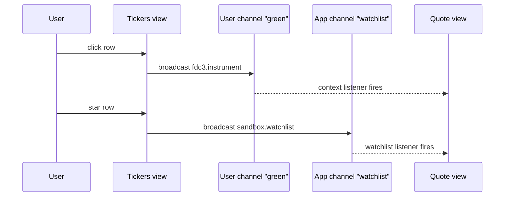

# Turborepo OpenFin Sandbox

A small turborepo that boots an [OpenFin Workspace](https://developers.openfin.co/of-docs/docs/workspace-overview) platform and demonstrates [FDC3 2.0](https://fdc3.finos.org/docs/fdc3-intro) interop between two React views.

## What you'll see

Run the platform and you'll get an OpenFin provider window plus the Workspace **Home** launcher. From Home you can open two views:

- **Tickers** — a list of instruments. Clicking a row broadcasts an `fdc3.instrument` context on the current user channel. Starring a row broadcasts a custom `sandbox.watchlist` event on the `watchlist` app channel.
- **Quote** — listens on both channels. The instrument panel updates when you pick a ticker; the watchlist fills up as you star things.

Both views are on the same user channel (`green`) so they share context automatically.

## Quick start

```bash
pnpm install
pnpm dev
```

`pnpm dev` runs Vite for all three apps in parallel:

- platform-provider on `http://localhost:5173`
- tickers on `http://localhost:5174`
- quote on `http://localhost:5175`

In a second terminal, launch the OpenFin runtime against the local manifest:

```bash
pnpm --filter platform-provider client
```

This uses `@openfin/node-adapter` to download the pinned OpenFin Runtime on first run, then opens the platform window and registers Home.

## Try the FDC3 flow

1. When Home opens, type `tickers` and press Enter to launch the Tickers view.
2. Do the same for `quote`.
3. Click a row in Tickers — the Quote view fills in with that instrument's details.
4. Star a few rows — they appear in Quote's watchlist panel.
5. Click a different row — Quote swaps instruments but the watchlist sticks, because the watchlist lives on a separate app channel.

## Repo layout

```
apps/
  platform-provider/   OpenFin Workspace platform host (port 5173)
  tickers/             Broadcaster view (port 5174)
  quote/               Listener view (port 5175)
packages/
  fdc3/                Shared @repo/fdc3 — context factories, type guards, app channels, mock catalog
  ui/                  Shared UI components
  eslint-config/
  typescript-config/
```

The platform manifest lives at [apps/platform-provider/public/platform/manifest.fin.json](apps/platform-provider/public/platform/manifest.fin.json) and lists the two views as apps Home can launch. Each view has its own `*.fin.json` declaring `fdc3InteropApi: "2.0"` and joining the `green` user channel.

## How the pieces talk



The user channel is standard FDC3 — any app joined to `green` gets the broadcast. The watchlist uses an [app channel](https://fdc3.finos.org/docs/api/ref/DesktopAgent#getorcreatechannel) so add/remove events stay separate from the currently-selected instrument.

## Shared FDC3 package

`@repo/fdc3` (in [packages/fdc3](packages/fdc3)) is where both views agree on shapes. It exposes:

- `createInstrumentContext` / `createContactContext` / `createWatchlistEvent` — factories that build FDC3-shaped contexts so a required field can't be forgotten.
- `isInstrumentContext` / `isWatchlistEvent` — runtime type guards for incoming contexts.
- `AppChannels.Watchlist` — the channel id, so broadcasters and listeners can't drift apart.
- `INSTRUMENT_CATALOG` / `lookupInstrument` — a tiny mock catalog used by both views instead of a real market data API.
- Re-exports of the FINOS FDC3 types (`Context`, `Instrument`, `Channel`, etc.) so consumers only need to depend on `@repo/fdc3`.

## Scripts

Run from the repo root:

| Script | What it does |
| --- | --- |
| `pnpm dev` | Runs all apps in dev mode via turbo |
| `pnpm build` | Builds all apps and packages |
| `pnpm lint` | Lints everything |
| `pnpm check-types` | TypeScript check across the workspace |
| `pnpm format` | Prettier over `**/*.{ts,tsx,md}` |
| `pnpm --filter platform-provider client` | Launches the OpenFin runtime against the local manifest |
